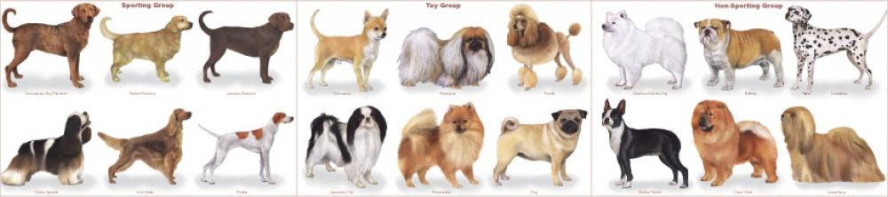

# Classifying Dog Breeds Using CNNs and PyTorch

##### &nbsp;

*Image credit: [pethelpful.com](https://pethelpful.com/dogs/Tips-on-Choosing-the-Right-Dog-Breed)*

##### &nbsp;
## Overview
This project is inspired by the [Kaggle Dog Breed competition](https://www.kaggle.com/c/dog-breed-identification). The goal of this project is to build a pipeline that could be used in a web or mobile app to process real-world images. The pipeline must be able to:

1. Detect whether an image contains a dog or human, and distinguish between the two.
1. If given an image of a dog, the model predicts the canine’s breed with at least 60% accuracy. Random chance is only 0.75% since there are 133  dog breeds (classes) in the dataset.
1. If given an image of a human, the model identifies the dog breeds the person most resembles.

Here are two sample outputs from the final algorithm:

#### Learning Goals

- Explore top performing CNN models for classification, including **VGG, ResNet, InceptionV3, and Xception** network architectures.
	- And use using **transfer learning** to implement a subset of these architectures.
- Pipeline in **PyTorch**.
- Understand the challenges involved in piecing together a series of models designed to perform various tasks in a data processing pipeline.  Each model has its strengths and weaknesses, and engineering a real-world application often involves solving many problems without a perfect answer. The solution developed in this project will be far from perfect, but it should create a fun user experience!

##### &nbsp;

### Steps (high-level)
1. Data Preparation
	- Load, inspect, and pre-process the data
	- Create datasets for training, validation, and testing
	- Augment the training data
1. Build CNN for recognizing dog breeds
	- Utilize transfer learning: Load pre-trained model and replace last fully connected layer.
	- Setup hyperparameters
	- Setup the optimization, regularization, and loss functions
	- Train the model on the dog images
	- Examine results
		- Is the model converging? What are the training and validation accuracies?
		- Preview model predictions
		- Tweak, tune, and iterate until predictions and metrics look sound
		- Run on test image set
	- Inference
		- Take a deeper look at model predictions including confidence scores
1. Incorporate human face detector
	- Choose an existing face detection package and test it
1. Integrate dog detector and human detector into single algorithm
	- Test algorithm on set of real-world images

##### &nbsp;
## Reflections
### Improving Accuracy
- **Additional training on the more difficult breeds.**
	- Create a new training set with a distribution based on prediction accuracy &mdash; i.e., poor performing breeds have more training images, while higher performing breeds have fewer images.
- **Deeper architecture + Augmentation**
	- My Keras+Tensorflow version used a deep architecture (Xception), but did not use augmentation. Conversely, my PyTorch version used augmentation, but a less elaborate architecture (ResNet). Combining these two and exploring other augmentation schemes *should* improve accuracy.
- **Train longer.**
	- In my PyTorch version, it seems I may have left some additional convergence on the table. My training accuracy was still quite low, probably due to all the augmentations. Perhaps given more training time this could have translated to marginally higher validation and test accuracies.
